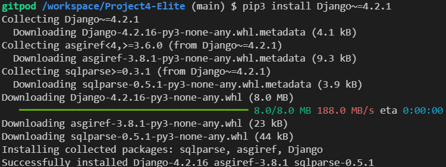

# Deployment

It is assumed the user knows how to create a repository on Github.
The linked repo template from the [Code Institute](https://github.com/Code-Institute-Org/gitpod-full-template) was used to start the project.

1. Install Django 4.2.1 with required packages
2. Create a new Django project
3. Set up project to use PostgreSQL and Cloudinary
4. Deploy project to Heroku

## Install Django 3.2 (LTS) with required packages.

*Django*, a full stack framework will support this project.

To install, type *pip3 install Django~=4.2.1* into the Gitpod terminal.

Use command *pip3 freeze --local > requirements.txt* to create requirements.txt and add relavent packages to it. 