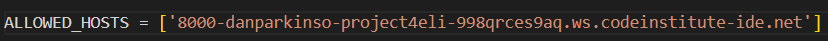
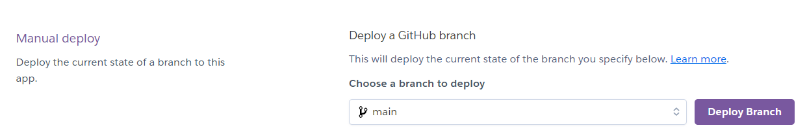

# Deployment

It is assumed the user knows how to create a repository on Github.
The linked repo template from the [Code Institute](https://github.com/Code-Institute-Org/gitpod-full-template) was used to start the project.

1. Install Django 4.2.1 with required packages
2. Create a new Django project
3. Create home app
3. Set up project to use PostgreSQL and Cloudinary
4. Deploy project to Heroku

## Install Django 3.2 (LTS) with required packages.

*Django*, a full stack framework will support this project.

To install, type *pip3 install Django~=4.2.1* into the Gitpod terminal.

Use command *pip3 freeze --local > requirements.txt* to create requirements.txt and add relavent packages to it. 

## Install gunicorn

To install, type *pip3 install gunicorn~=20.1* into the Gitpod terminal.

Use command *pip3 freeze --local > requirements.txt* to create requirements.txt and add relavent packages to it.

## Install Whitenoise

To install, type *pip3 install whitenoise~=6.5.0* into the Gitpod terminal.

Use command *pip3 freeze --local > requirements.txt* to create requirements.txt and add relavent packages to it.

# Install Psycopg2 and dj-database-url

To install, type *pip3 install dj_database_url~=0.5 psycopg2~=2.9* into the Gitpod terminal.

Use command *pip3 freeze --local > requirements.txt* to create requirements.txt and add relavent packages to it.

# Create Django Project

Using the command *django-admin startproject elite-cuisine* creates our django project.

Using the command *python3 manage.py runserver* opens the server in port 8000. The server needs allowed hosts in *elite-cuisine/settings.py* to be added.

Add to allowed hosts in *elite-cuisine/settings.py*

In the terminal, type *python3 manage.py runserver* to verify local deployment. A message to open a page in the browser pops up using port 8000.

# Create home app

In the terminal, type *python3 manage.py startapp home* to create out homepage app.

# Deploy to Heroku 

Navigate to your Heroku dashboard and create a new Heroku app.

Add *DISABLE_COLLECTSTATIC* with a Value of 1 to stop Heroku uploading static files.

Create a Procfile to allow Heroku to deploy using Gunicorn.

Add Heroku to allowed hosts in elite_cuisine/settings.py.

Connect Heroku to your Github account.

Click deploy branch and wait for completion.

Add Eco Dynos.

# Connect PostgreSQL

Create and env.py file in the top directory and use this code. The postgreSQL code was generated from Code Institute. It has been redacted from the image.

Use the following code to connect the env.py in the elite_cuisine/settings.py

in the elite_cuisine/settings.py file, disconnect the splite database by commenting out the code.

Use dj-databse-url to connect.

# Create superuser

Using the terminal command *python3 manage.py migrate*, create a database.

Create a superuser using djangos built in admin and auth apps using temrinal command *python3 manage.py createsuperuser*.

# Connect Heroku to postgreSQL

Deploy a new branch in Heroku.

Create a new convig-var using the name DATABASE-URL and a value of your postgreSQL. This connects Heroku to the postgreSQL.

# Secret Key

Generate a secret key using letters, numbers and symbols that is hard to guess. This is used to keep information private.
Add it to the env.py file with the following code.

Update the settings.py file.

Add secret key as a config-var to Heroku. The name should be SECRET_KEY. The value should be your secret key value. 

If done correctly, both local and Heroku deployment should work.

