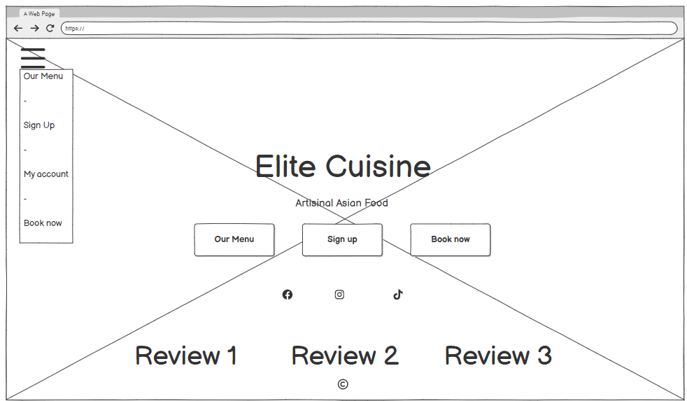
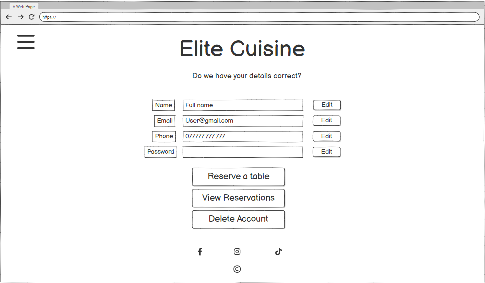
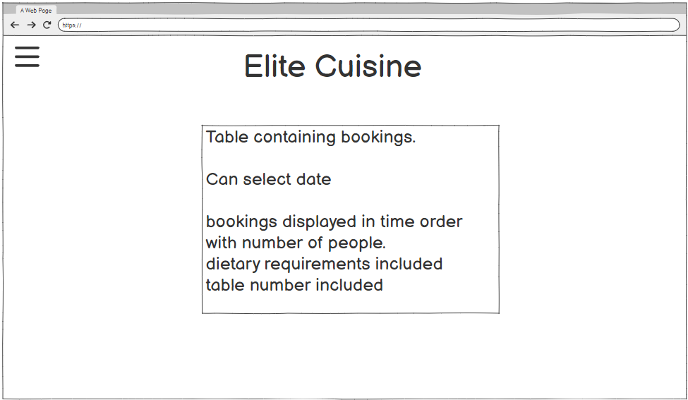

# README

## Table of Contents
1. Introduction
    - Scenario

2. UX
    - User Stories
    - Design Thinking

3. Features
    - Design Features
    - Existing Features
    - Future Adaptations

4. Issues and Bugs

5. Technologies Used
    - Main Languages Used
    - Frameworks, Libraries & Programs Used

6. Testing
    - Testing.md

7. Deployment
    - Deployment.md

8. Credits
    - Content
    - People

9. Acknowledgements

## Introduction

# Elite Cuisine

Welcome to Elite Cuisine. An artisinal Asian brunch restaurant.

### Scenario

Restaraunts perform better with a steady stream of customers. These can be walk-ins or pre booked customers. At it's simplest the booking system could be a phone with pen and paper making notes.

Restaurants are busy places. With staff preparing food, waiting tables and providing outstanding customer care. Taking bookings take up a lot of valuable time for service staff. If the phone rings whilst all servers are busy the phone might not be answered. And a ringing phone can ruin the ambience of a restaurant.

It can help the business if customers use an online booking system instead. This dosen't take up valuable staffs time. Bookings could also be made out of working hours, increasing the accessability to the restaraunt, potentially increasing foot traffic and profits. 

A lot of people also refer a passsive booking system where no human interaction is needed. Meaning a larger clientel.

A business with a well developed website tends to do better than its peers. Customers can gain a better insight of its ethos, facilities and services on offer. In theory this fosters confidence and leads to greater engagement.

With the above in mind, let's create the website!

## UX 

### User Stories

Following an Agile paradigm, user stories will target customer needs and reduce embellishments on the part of the developer. These non technical statements will aid with the incremental changes needed to build the application.

Site user needs can broadly be split into 4 categories or epics:

- Navigation 
- Account Management
- Reservation management
- Other 

#### NAVIGATION

- **As an** unregistered user, **I can** navigate to a page **so that** I can view the services offered by the business

- **As an** unregistered user, **I can** follow a link **so that** I can view the social medias of Elite Cuisine

- **As an** unregistered user, **I can** use a navigation bar **so that** I can navigate the site on all views

- **As a** user, **I can** follow a link **so that** I can create/ log on to my account

#### ACCOUNT MANAGEMENT

- **As an** unregistered user, **I can** provide details **so that** I can create an account

- **As a** registered user, **I can** provide details **so that** I can login to my account

- **As an** unregistered user, **I can** create a unique password **so that** I can protect my personal account

- **As a** logged in user, **I can** view a page **so that** I can see my personal account details by individual field 

- **As a** logged in user, **I can** click a button **so that** I can change my personal account details by individual field 

- **As a** logged in user, **I can** click a button **so that** I can delete my account

- **As a** logged in user, **I can** request an email **so that** I can reset my account password if I have forgotten it

#### Reservation management

- **As a** logged in user, **I can** provide reservation details **so that** I can set up a reservation

- **As a** logged in user, **I can** update details **so that** I can reschedule my reservation

- **As a** logged in user, **I can** cancel an reservation **so that** I can cancel a reservation

- **As a** logged in user, **I can** recieve an email **so that** I can keep track of my reservations

- **As a** logged in user, **I can** view a page **so that** I can see my reservations in order

- **As an** employee, **I can** view a page **so that** I can see my reservations in order

#### OTHER

- **As a** user, **I can** view the site on a small screen **so that** I can use it when traveling with a mobile device

- **As an** unregistered user, **I can** view the landing page **so that** I understand the site's purpose

- **As a** registered user, **I can** leave a review **so that** I can give feedback

- **As an** admin, **I can** approve reviews **so that** reviews are relevant

## Design Thinking

[Agile](AGILE.md) use has been documented in a separate file.

Applying a *Design Thinking* approach, what *features* would users find most useful on the developed site?  How feasible is it for an inexperienced student developer to deliver prioritised features given the time constraints of a hard deadline?
As per assessment criteria, this project must utilise CRUD functionality.  This provides a broad outline of what is needed.  A brief though shower offered the following:

| Feature                                     | Importance | Feasibility |
|:--------------------------------------------|:----------:|:-----------:|
| View available services                     | 4          | 5           |
| Create personal account                     | 5          | 5           |
| Update account information                  | 5          | 5           |
| Able to cancel account                      | 5          | 5           |
| Make a reservation                          | 5          | 5           |
| Review latest reservation date/time         | 3          | 4           |
| Able to change/cancel a reservation         | 3          | 4           |
| Send client reservation detail via email    | 2          | 4           |
| Owner has calendar view of reservations     | 4          | 3           |
| **Overall Score**                           | **36**     | **40**      |
    
The above exercise indicates that overall importance/feasibility scores were similar.  Therefore the project should be deliverable.

### Colour Schema 

### Database Design 
Entity Relationship Diagrams help to visualise database architecture before creating models in Django.  Understanding the relationships between different tables can save time recoding later in the project.

Entity Relationship Diagram

#### Skeleton
Wireframes were made to showcase the appearance of the site pages while keeping a positive user experience in mind. The wireframes were created using a desktop version of [Balsamiq](https://balsamiq.com/).

Balsamiq Wireframes

## Features
### Design Features
### Existing Features
### Future Adaptations

## Issues and Bugs

## Technologies Used
### Main Languages Used
### Frameworks, Libraries & Programs Used

## Testing
Refer to [TESTING.md](TESTING.md) for details on manual and automated testing.
- manual testing
- automated testing
- Lighthouse site performance checks
- linter checks on HTML, CSS, JavaScript and Python code

## Deployment
This process has been documented separately in [DEPLOYMENT.md](DEPLOYMENT.md)

## Credits
### Content
- balsamiq for wireframes 
- DrawSQL for database design 
### People

## Acknowledgements

https://www.geeksforgeeks.org/form-as_p-render-django-forms-as-paragraph/

https://www.youtube.com/watch?v=tUqUdu0Sjyc

https://docs.djangoproject.com/en/5.1/topics/auth/default/

https://docs.djangoproject.com/en/3.0/ref/validators/

[Back to top](#README)