# Testing

A variety of exploratory tests were performed throughout the project.

## Manual Testing

1. Getting the live deployed site working. This is well documented in the latter sections of [DEPLOYMENT.md](DEPLOYMENT.md)

2. Checking the deployed site opens on the homepage.
- create a function based view in home
- create a path in the url file in the home app
- reference the home app url in the main project url file

Add the following code to the *home/views.py* file. This tells the server to display "This is the homepage"

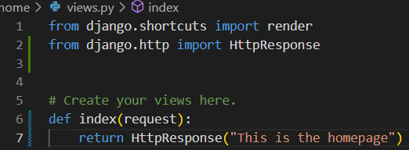

Add the following code to the *elite_cuisine/urls.py* file.

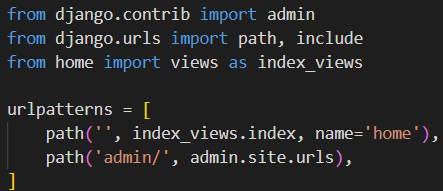

Add the following code to the *elite_cuisine/settings.py* file to installed apps.

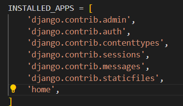

Use command *python3 manage.py runserver* to check the home app is linked correctly.

### Creating templates

Update the *home/views.py* file.

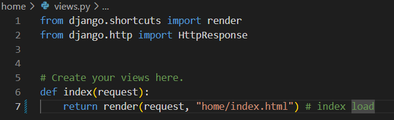

Create and update the *home/urls.py* file.

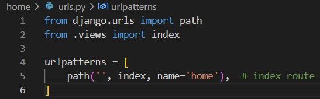

Update the *elite_cuisine/urls.py* file.

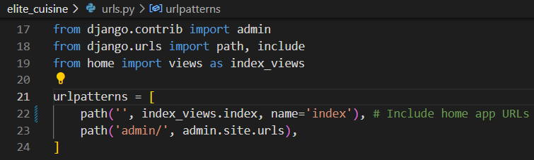

Run server using command *python3 manage.py runserver* to view that urls route is correct. Error syaing *templates does not exist* shows route is correct.

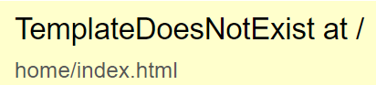

elite_cuisine/settings.py needs updatinf with templates DIR.

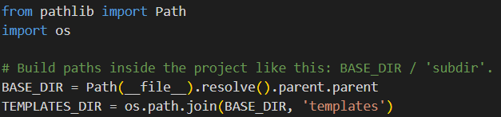

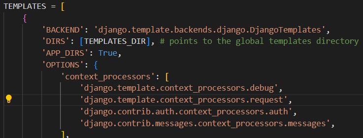

After creating the base.html, partial htmls and index.html in the templates directory. The server now responds with index.html. 

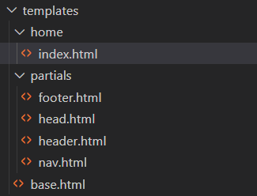

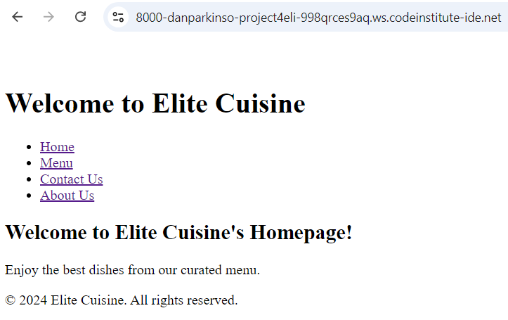

### superuser 

When i originally tried to login as a superuser i recieved this error.

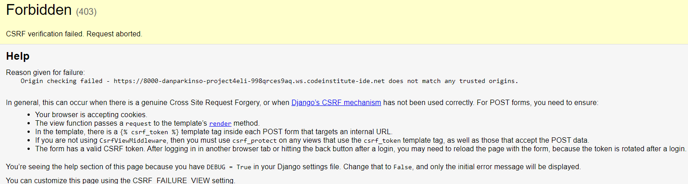

After using code institute support i had forgotten to add.

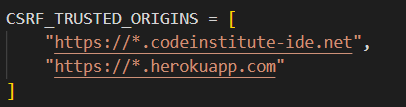

Admin login now functions correctly.

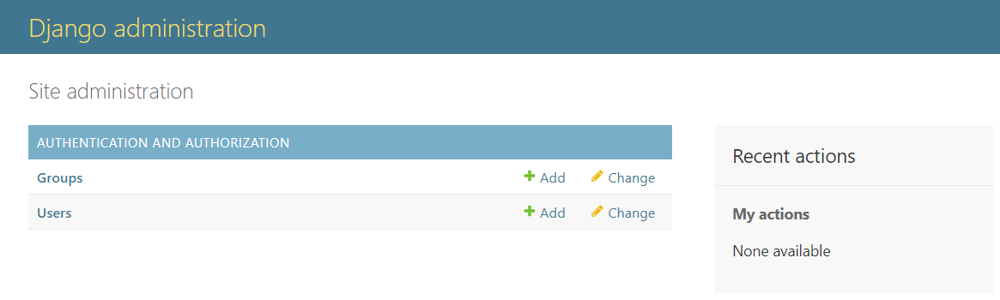

### CSS and JS

### Django auth function 

Django includes a built in authentication system to register, login and log out of accounts. In *elite_cuisine/urls.py* add the url link to load auth package.

'''

path('accounts/', include('django.contrib.auth.urls')), #Authentication URLS

'''

Appending */accounts/login* or */accounts/logout* to the server URL should load a page. 

*/accounts/login* gives an error saying no template present. Thats because it needs to be created.

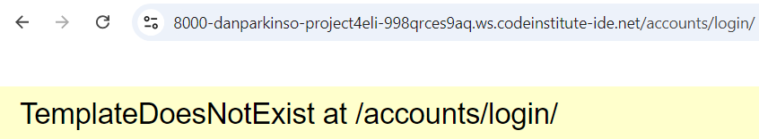

*/accounts/logout* provides this:

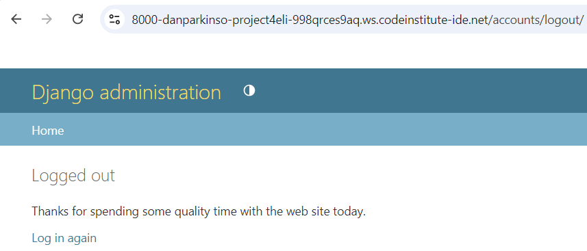

Now that they load I need to create a registration from for users to log into

