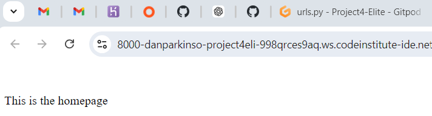

# Testing

A variety of exploratory tests were performed throughout the project.

## Manual Testing

1. Getting the live deployed site working. This is well documented in the latter sections of [DEPLOYMENT.md](DEPLOYMENT.md)

2. Checking the deployed site opens on the homepage.
- create a function based view in home
- create a path in the url file in the home app
- reference the home app url in the main project url file

Add the following code to the *home/views.py* file. This tells the server to display "This is the homepage"

Add the following code to the *elite_cuisine/urls.py* file.

Add the following code to the *elite_cuisine/settings.py* file to installed apps.

Use command *python3 manage.py runserver* to check the home app is linked correctly.

